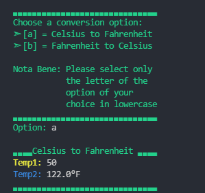

# Ruby Temperature Converter
A simple tool written in Ruby for conversion of temperature.

## Supported Conversions 
- [X] Celsius to Fahrenheit
- [ ] Celsius to Kelvin
- [X] Fahrenheit to Celsius
- [ ] Fahrenheit to Kelvin
- [ ] Kelvin to Celsius
- [ ] Kelvin to Fahrenheit

## Preview


## How to use?
#### Install the Ruby language first.
Download here => https://www.ruby-lang.org/en/downloads/ <br/>
Easy Installer => https://rubyinstaller.org/downloads/

Download or clone this git repository first and open your terminal or the powershell and <br/>change directory to the location of the repository folder<br/>
Example: <br/>
```
cd C:\Users\User\Downloads\ruby-temperature-converter
```

And then execute the script <br/>
```
ruby main.rb </code>
```

## Notice
I am new to Ruby and if you have any suggestions in improvidng the code, I would be greatful.


